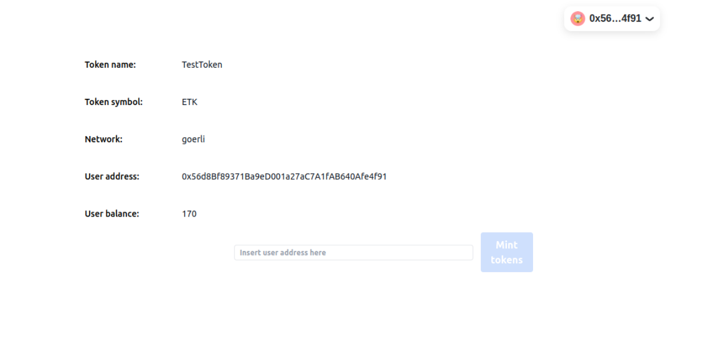

# TestToken minting page

React frontend to mint test token on Göerli network.

## How to run project

1. Run `yarn install` at the root of your directory
2. In `src/values/index.js` set SERVER_API_BASE_URL, default; localhost:4000 (run the [local server](https://github.com/Martijncvv/mint-token-backend))
3. Run `yarn start` to start the project

### Dashboard preview

 
  

## Directory Structure

| Folder     | Content                    |
| ---------- | -------------------------- |
| components | All UI components          |
| hooks      | Used React Hooks           |
| store      | App state management files |
| values     | All constants/ abi files   |

### Backend Repo

[Backend Repo](https://github.com/Martijncvv/mint-token-backend)
